# SeaWorm

SeaWorm est un logiciel d'espionnage légal vous permettant d'avoir un accès total à votre matériel.


---
( /!\ **Utiliser SeaWorm sur un matériel qui ne vous appartient pas est interdit par la loi et je ne suis pas responsable d'une mauvaise utilisation du logiciel** )

`Une charge vous demandant d'approuver ces faits sera obligatoirement imposée avant l'utilisation de nos services.`


## Platforms:

    - Pc ( windows )
    - android ( après la version desktop )
---

## Client-CLI
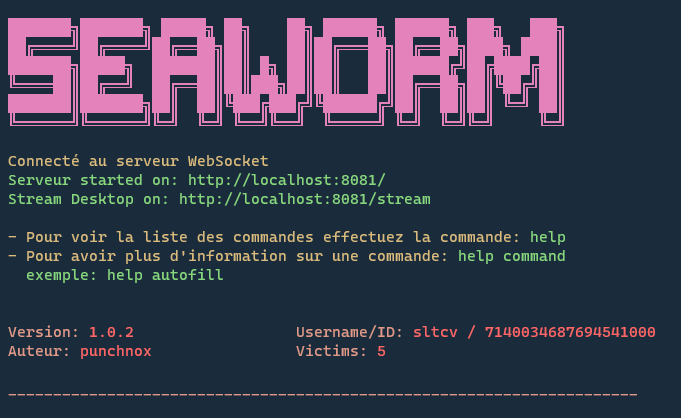
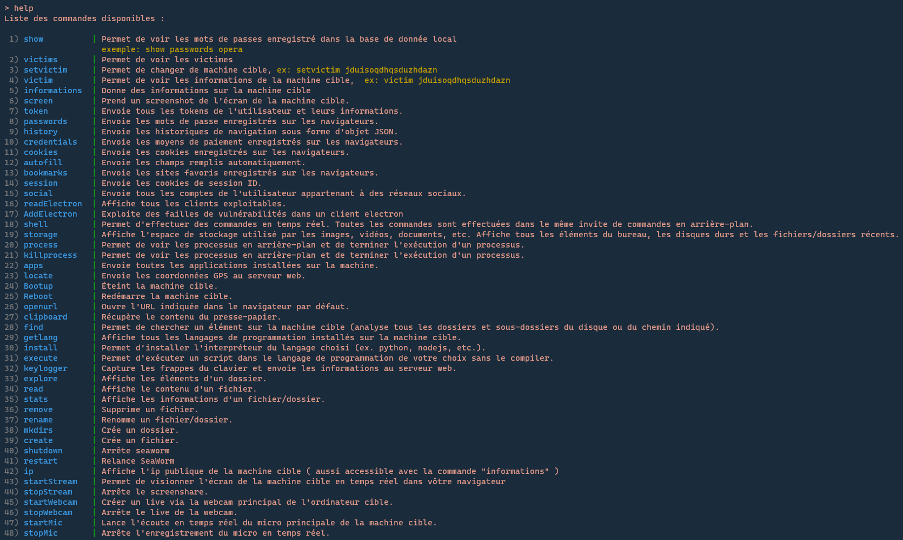
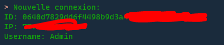

### **Voici la liste des fonctionnalités de SeaWorm déjà développées.**

## System
    > fonctionnalités disponibles
        - process/killprocess: Permet de voir les processus en arrière plan et de terminer l'execution d'un processus
        - SHELL: permet d'effectuer des commandes en temps réel ( toutes les commandes sont effectué dans le même invite de commandes en arrière plan )
        - screenshot: prend un screen de l'écran de la machine cible
        - apps: envoie toutes les applications installées sur la machine
        - locate: envoie les coordonnées GPS au serveur web
        - Bootup: éteint la machine cible
        - Reboot: redémarre la machine cible
        - openurl: ouvre l'URL indiquée dans le navigateur par défaut
        - clipboard: récupère le contenu du presse-papier
        - storage: affiche l'espace de stockage utilisé par les images, vidéos, documents et autres, affiche tout les elements du bureau, les disques dures et les fichiers/dossiers récents
        - find: permet de chercher un element sur la machine cible ( analyse tous les dossiers et sous dossiers du disque ou du chemin indiqué )
        - getlang: Affiche tout les langages de programmations installés sur la machine cible
        - install {lang: python, nodejs...}: permet d'installer l'interpréteur du langage choisis
        - execute {lang, script}: Permet d'executer un script dans le langage de programmation de vôtre choix sans le compiler
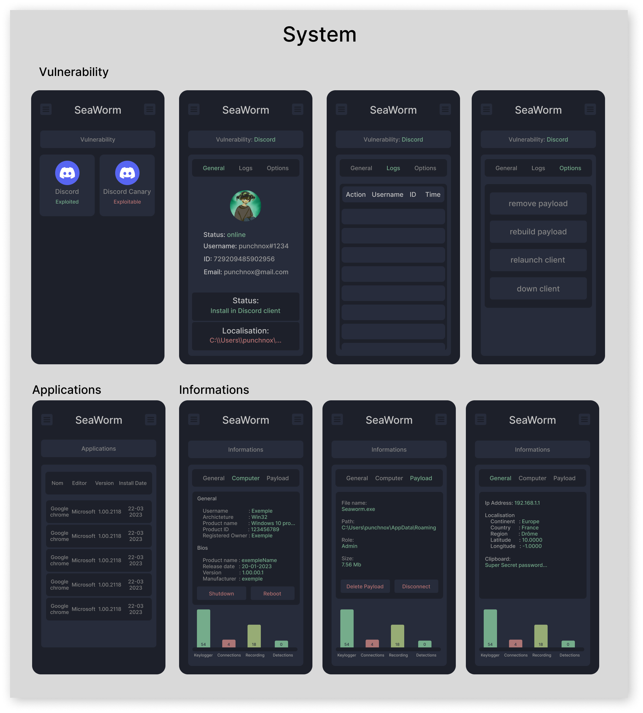
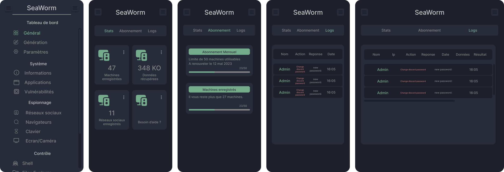
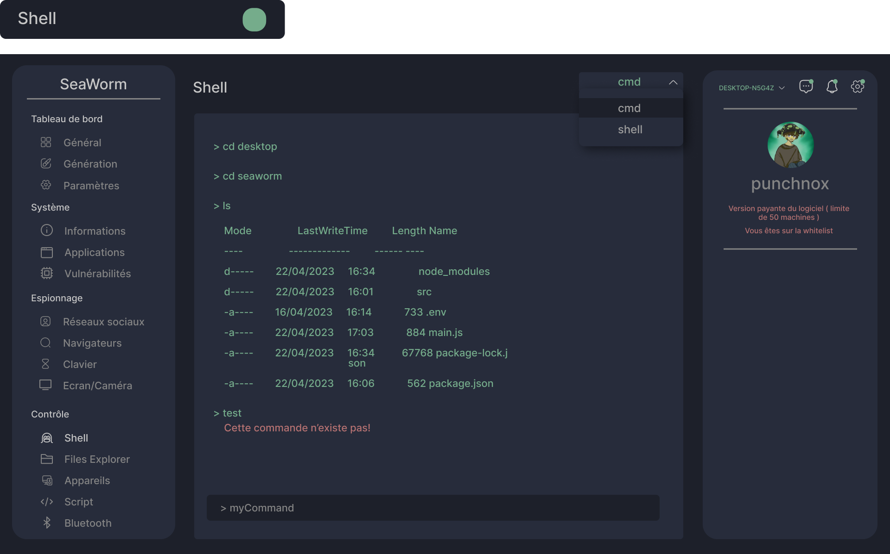
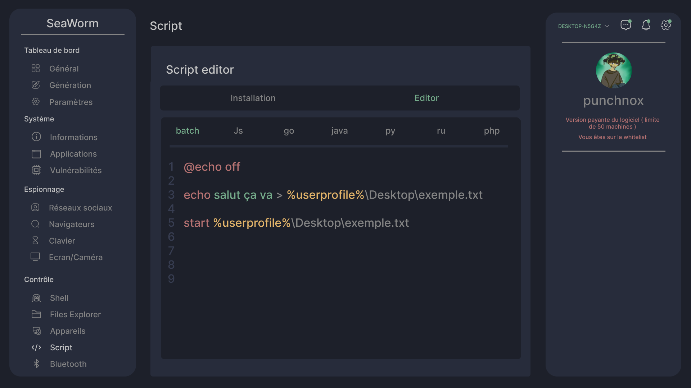
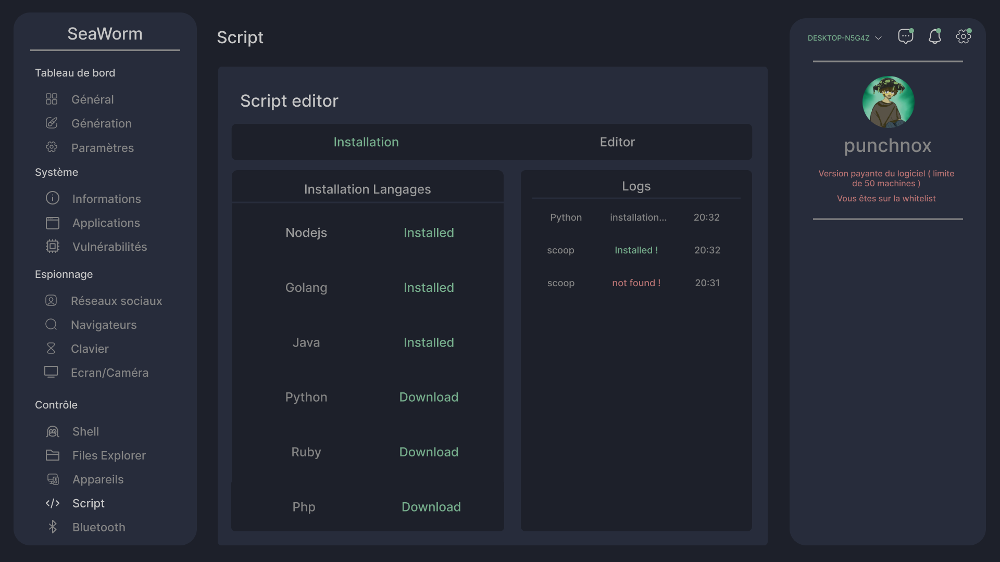

## Steal
  > fonctionnalités disponibles:

    - history: envoie les historiques de navigation sous forme d'objet JSON
    - autofill: envoie les champs remplis automatiquement
    - bookmarks: envoie les sites favoris enregistrés sur les navigateurs
    - cookies: envoie les cookies enregistrés sur les navigateurs
    - passwords: envoie les mots de passe enregistrés sur les navigateurs
    - credential: envoie les moyens de paiement enregistrés sur les navigateurs
    - session: envoie les cookies de session ID
    - social: envoie tous les comptes de l'utilisateur appartenant à des réseaux sociaux
    - token: envoie tous les tokens de l'utilisateurs et leurs informations comme l'exemple ci-dessous
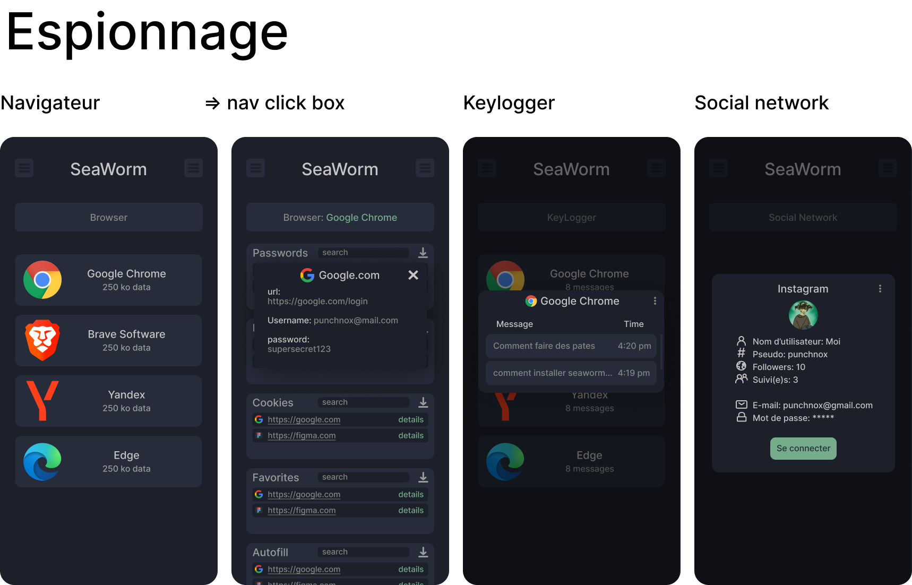

## File explorer
  > fonctionnalités disponibles:

    - explore: affiche les éléments d'un dossier
    - read: affiche le contenu d'un fichier
    - stats: affiche les informations d'un fichier/dossier
    - remove: supprime un fichier
    - rename: renomme un fichier/dossier
    - mkdirs: crée un dossier
    - create: crée un fichier
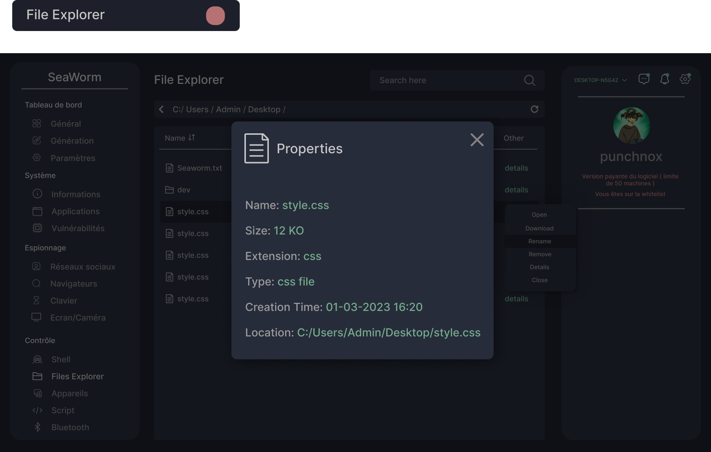
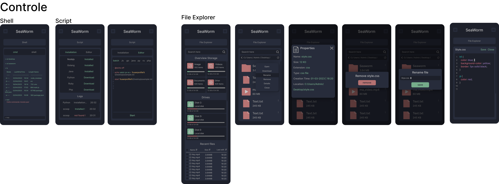

## Spy
  > Options d'injection:

    - Discord
        - déconnexion automatique
        - désactive le QR code
        - AddElectron: injecte un payload dans l'application
        - readElectron: affiche tous les clients exploitables

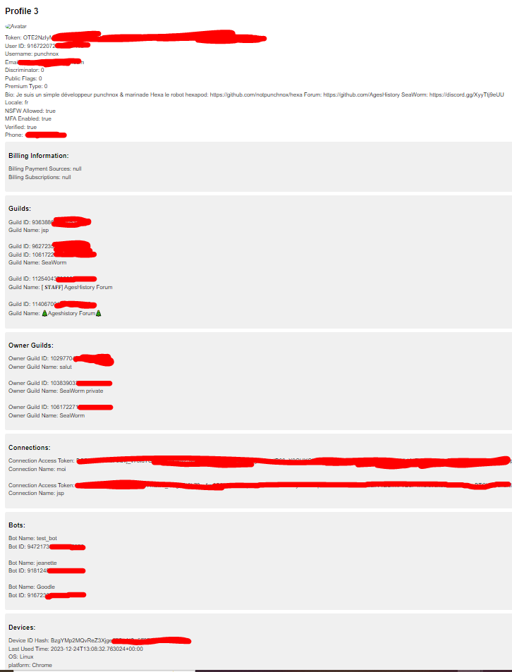
    

  > Événements ( informations récupérables en temps réel en cas d'injection de payload SeaWorm dans un client electron, dans le cas de toutes les versions de Discord ):
    
    - Discord
        - logout: l'utilisateur a été déconnecté
        - mail: l'utilisateur a changé d'email
        - pass: l'utilisateur a changé de mot de passe
        - login: l'utilisateur vient de se connecter
        - cc: l'utilisateur a ajouté une carte de crédit
        - pal: l'utilisateur a ajouté un compte PayPal
        - nitrob: l'utilisateur a acheté un Nitro

  > Enregistrement en temps réel:
    
    - Screenshare: démarrage/arrêt
    - Webcam: démarrage/arrêt
    - Key/Window Logger: démarrage/arrêt
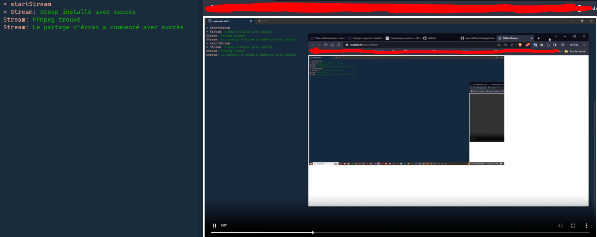
    

## SeaWorm Desktop ( golang )
> Commandes disponibles:

    - restart: relance le payload
    - shutdown: éteint le payload

## Logs
> informations disponibles en temps réel:
    - recevez une notifications dès qu'un de vos matériels est connecté

## Router
> Fonctions disponibles:

    - Router.Http: enregistre la machine
    - Router.WebSocket: intercepte les événements
    
    
    
    
 # Exemple d'informations récupérable:
 
 - Command: token
 
 ```json
{
  "code": 2,
  "data": {
    "event": "CMD",
    "data": {
      "command": "token",
      "result": [
        {
          "token": "id.date.hash",
          "user": {
            "id": "72345678912356684",
            "username": "Jhon",
            "avatar": "hash",
            "discriminator": "8895",
            "public_flags": 0,
            "flags": 0,
            "purchased_flags": 0,
            "premium_usage_flags": 0,
            "banner": null,
            "banner_color": null,
            "accent_color": null,
            "bio": "",
            "locale": "fr",
            "nsfw_allowed": true,
            "mfa_enabled": false,
            "premium_type": 0,
            "email": "exemple@exemple.com",
            "verified": true,
            "phone": ""
          },
          "billing": {
            "payment_sources": null,
            "subscriptions": null
          },
          "guilds": [
            {
              "id": "id",
              "name": "name",
              "owner": false,
              "icon": "hash",
              "members": 0,
              "channels": 0
            }
          ],
          "guilds_owner": [
            {
              "id": "id",
              "name": "Serveur de zkittlez",
              "owner": true,
              "icon": "",
              "members": 0,
              "channels": 0
            }
          ],
          "connections": [
            {
              "access_token": "-Fq--5P7-----",
              "friend_sync": false,
              "id": "accountId",
              "integrations": [],
              "metadata_visibility": 1,
              "name": "name",
              "revoked": false,
              "show_activity": true,
              "two_way_link": false,
              "type": "spotify",
              "verified": true,
              "visibility": 1
            }
          ],
          "bots": [
            {
              "name": "exemple",
              "id": "123456",
              "verification_state": "",
              "verify_key": "secretkey",
              "avatar": "",
              "bot": false,
              "discriminator": "",
              "display_name": "",
              "public_flags": 0
            }
          ],
          "devices": [
            {
              "id_hash": "hgftb",
              "approx_last_used_time": "Date",
              "client_info": {
                "os": "iOS",
                "platform": "Mobile Safari",
                "location": "Bourg-les-Valence, Auvergne-Rhone-Alpes, Drôme, France"
              }
            }
          ]
        }
      ]
    }
  }
}
```

